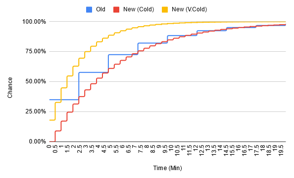

# Slower Colds

Slower Colds is maily intended to stop the annoying "instant" colds in Outward.

Outward has a very slow 2.5 minute (1 in game hour) check frequency for cold infections, which is probably why the chance is so high at 35%. The issue is that the first check usually happens immediately upon reaching the temperature threshold, meaning a fair amount of the time you will immediately catch a cold the moment you hit 40 temperature (`Needs: Cold`), which is a bit unrealistic and heavily punishes momentary temperature drops.

Slower Colds implements a more frequent check with a lower infection rate, smoothing out the curve, while also allowing minimum times before infection can happen. It checks for `Needs: Cold` or `Needs: Very Cold` instead of temperature, and uses the found status's age as timer.

The default values for `Needs: Cold` create a curve similar to vanilla without the sudden large front loaded jumps and a 30 second minimum, while `Needs: Very Cold` has twice the infection chance as and no minimum time. Both check every 30 seconds instead of 150.

## Config

`Needs: Cold` and `Needs: Very Cold` each can have their own values for the following:

* `Chance`: percent chance of catching a cold
* `Min Time`: minimum time before the first check
* `Check Frequency`: how often to check again
